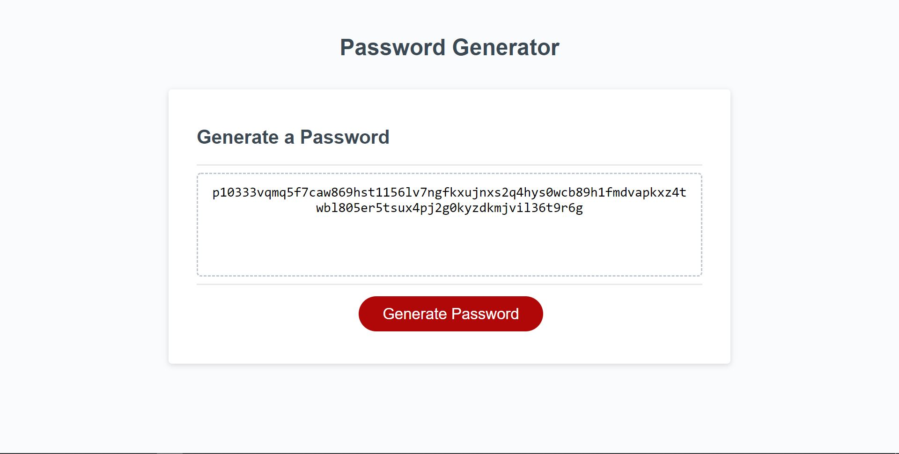

# Password-Generator
This project was completed for KU's coding bootcamp assignment 3. 

The goal of this assignment was to of course make a random password generator but also to get a better understanding of JavaScript.

## Check out the Project
Check out the different aspects fo the project below:

- [GitHub Page](https://johnathanmann.github.io/Password-Gen/)
- [Repository](https://github.com/johnathanmann/Password-Ge)
- [Video of deployed application](https://watch.screencastify.com/v/aFVwpkoSQxhPxLRXRE0W)
* Please note not all password combinations are seen in video *

## Install
Feel free to install using GitHubs recommended clone methods or by downloading the code and opening it in your preferred text editor.

## Requirments
To use the project all you need is a browser, but to access the code you need your text editor of choice.

## Summary
This site can be used to randomely generate a password through different prompts and confirms. The user can choose the length of their password (between 8-128 characters), if they want to include lower case letters, upper case letters, numbers, and special characters. 

The password is generated through the shuffling of various arrays. The arrays are created based on the specifications provided by the user. They are then trimmed down to be the users chosen length. 